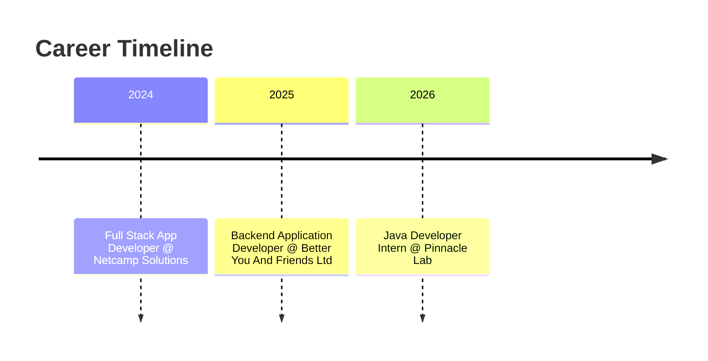

<div align="center">


<br/>


<br/>

<a href="https://www.linkedin.com/in/sde-abhishek-kumar/">
  
</a>
<a href="https://github.com/SDE-Abhishekkumar">
  
</a>
<a href="https://leetcode.com/u/abhi_singh1234">
  
</a>
<a href="mailto:sde.abhishekkumarsingh@gmail.com">
  
</a>
<a href="#">
  
</a>

<br/><br/>


<br/>


</div>


## 👨‍💻 About Me


Hey there! I'm **Abhishek** — a passionate **Software Developer** who bridges **engineering** and **data intelligence**. I build full-stack applications that are not only functional but also data-aware. Whether it's a native Android app, a robust backend service, or an ML-powered feature, I love owning the entire lifecycle.

Currently pursuing my **Master of Computer Applications (AI/ML)**, I combine academic depth with hands-on industry experience. I've worked with startups and remote teams, delivering production-ready code using **Java**, **Node.js**, **React**, and **Python**.

```
> "Code that solves real problems – that's what drives me."
```

🔭 Currently building — **Java-based e-commerce & weather apps @ Pinnacle Lab**
🌱 Currently learning — **Deep Learning, NLP & Data Visualization**
👯 Looking to collaborate on — **AI-powered full-stack products**
💬 Ask me about — **Java, React, Android, REST APIs, ML pipelines**
⚡ Fun fact — **I turn single HTML files into fully animated 3D experiences**

<br clear="both"/>

### 🪐 Tech Orbit — Live SVG Visualization

<div align="center">

</div>

### 💻 Live Terminal Session

<div align="center">

</div>

> *💡 Both graphics above are custom-built SVGs (not third-party badges). Make sure `tech-orbit.svg` and `Terminal animation.svg` sit in the root of your `SDE-Abhishekkumar/SDE-Abhishekkumar` profile repo (not inside a subfolder) for the links above to render.*

<div align="center">

</div>


## 📊 GitHub Analytics & Activity

<div align="center">

</div>

<div align="center">


</div>

### 🧊 3D Contribution Calendar

<div align="center">


> *💡 This needs a one-time setup: add the `generate-3d-contrib.yml` workflow (provided below) to `.github/workflows/` in your profile repo, run it once from the Actions tab, and it will auto-generate `profile-3d-contrib/profile-night-rainbow.svg` and keep it updated daily.*
</div>

### 📊 Animated Skill Proficiency

<div align="center">

</div>

### 🧬 Isometric Repo Activity

<div align="center">

</div>


## 🧩 LeetCode Dashboard — Full Stats & Heatmap

I actively solve Data Structures & Algorithms problems daily. Below is my **complete LeetCode progress** — total solved, difficulty breakdown, global ranking, acceptance rate, and a **submission heatmap calendar** (auto-updated).

<div align="center">
<a href="https://leetcode.com/u/abhi_singh1234">
  
</a>
</div>

### 📈 Difficulty Breakdown (Live)

<div align="center">


<table>
<tr><td><b>Easy</b></td><td><progress value="60" max="100" style="width:300px;height:22px;accent-color:#00FF88;"></progress></td><td>60%</td></tr>
<tr><td><b>Medium</b></td><td><progress value="30" max="100" style="width:300px;height:22px;accent-color:#FFD700;"></progress></td><td>30%</td></tr>
<tr><td><b>Hard</b></td><td><progress value="10" max="100" style="width:300px;height:22px;accent-color:#FF4444;"></progress></td><td>10%</td></tr>
</table>

</div>


## 🐍 Contribution Snake Game

<p align="center">
  <picture>
    <source media="(prefers-color-scheme: dark)" srcset="https://raw.githubusercontent.com/SDE-Abhishekkumar/SDE-Abhishekkumar/output/github-snake-dark.svg" />
    <source media="(prefers-color-scheme: light)" srcset="https://raw.githubusercontent.com/SDE-Abhishekkumar/SDE-Abhishekkumar/output/github-snake.svg" />
    
  </picture>
</p>

> *💡 To enable the animated snake, add the [`snk` workflow](https://github.com/Platane/snk) to your `.github/workflows/` folder.*


## 💼 Professional Experience

<div align="center">



</div>

| Role | Company | Duration | Key Contributions |
|:---|:---|:---|:---|
| 🟢 **Java Developer Intern** | Pinnacle Lab | Jul 2026 – Present | Building e-commerce & weather apps in Java. Applied OOP & RESTful patterns. |
| 🔵 **Backend Application Developer** | Better You And Friends Ltd | Jul 2025 – Oct 2025 | Architected Node.js/Express APIs (5K+ daily reqs). Built React components & integrated ML workflows (Pandas/Scikit). |
| 🟣 **Full Stack App Developer** | Netcamp Solutions Pvt Ltd | Jul 2024 – Aug 2024 | Native Android dev with Firebase. Consumed REST APIs, enhanced app stability across 20+ devices. |


## 🛠️ Flagship Projects

<div align="center">

</div>

<div align="center">

<a href="https://github.com/SDE-Abhishekkumar/Green-India">

</a>


</div>

### 🌿 Green India — Sustainability App
`Java` `XML` `Android Studio` `Firebase` `REST APIs`


- 📍 Waste Management module for reporting & tracking disposal
- 🌱 Plantation Streak to gamify tree-planting habits
- 📊 Carbon Footprint Calculator using live API data
- 🔥 Firebase Auth + Real-time sync for seamless UX

### 🛒 E-Commerce Shopping Cart — Internship Project
`Java` `REST APIs` `OOP`


- Product browsing, cart management, order validation
- Modular SOLID design for easy scaling

### ☁️ Weather Forecast App — Internship Project
`Java` `OpenWeatherMap` `JSON`


- Real-time weather + 5-day forecast with dynamic icons
- Error handling and local caching


## 🧰 Tech Arsenal

<div align="center">


</div>

<div align="center">


</div>

| **Category** | **Technologies** |
|:---|:---|
| **Languages** |     |
| **Backend** |    |
| **Frontend** |    |
| **Mobile** |   |
| **ML / Data** |   |
| **Tools** |    |


## 📈 Advanced Live Metrics

<div align="center">


</div>

### 🗓️ GitHub Issues, PRs & Discussions

<div align="center">


</div>


## 📜 Certifications & Badges

<p align="left">
  
  
  
</p>

- 🧠 **Data Structures & Algorithms with Java** — Arrays, Trees, Graphs, DP
- 💼 **DSA Interview Prep** — Complexity analysis & problem-solving patterns
- 🔍 **Digital Forensics (NASSCOM)** — Cybercrime investigation & evidence handling


## 🎓 Education

| Degree | Institution | Year | Highlights |
|:---|:---|:---|:---|
| **MCA (AI/ML)** | Uttaranchal University | 2024 – 2026 | Python, ML, Deep Learning, NLP, Data Viz |
| **BCA** | University of Lucknow | 2021 – 2024 | DSA, OOP, DBMS, Web Dev |


## 💬 Random Dev Quote

<div align="center">

</div>


## 🌟 Let's Connect!

<div align="center">


I'm always open to **collaborations**, **mentorship**, or **exciting opportunities** — hit me up!

<a href="mailto:sde.abhishekkumarsingh@gmail.com"></a>
<a href="https://www.linkedin.com/in/sde-abhishek-kumar/"></a>
<a href="https://github.com/SDE-Abhishekkumar"></a>
<a href="https://leetcode.com/u/abhi_singh1234"></a>

<br/>


**"Building solutions, one line of code at a time." ✨**

</div>


